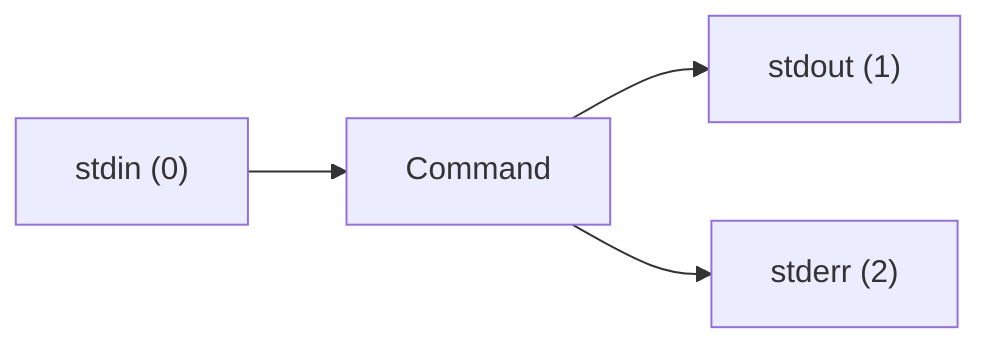

# Lesson 12 — I/O Redirection and Pipes

> **Goal:** Understand how Linux handles input and output, redirect data between commands, files, and streams.

---

## The Three Standard Streams

Every Linux command has three data channels:

| Stream | Number | Name | Default Destination |
| ------ | ------ | ---- | ------------------- |
| Standard Input | 0 | `stdin` | Keyboard |
| Standard Output | 1 | `stdout` | Terminal screen |
| Standard Error | 2 | `stderr` | Terminal screen |



Understanding these streams is key to controlling where data flows.

---

## Output Redirection

### Write to a File (`>`)

The `>` operator sends `stdout` to a file, **replacing** its contents:

```bash
echo "Hello" > greeting.txt
cat greeting.txt
# Output: Hello

# Overwrites the previous content
echo "Goodbye" > greeting.txt
cat greeting.txt
# Output: Goodbye
```

### Append to a File (`>>`)

The `>>` operator **adds** to the end of a file:

```bash
echo "Line 1" > log.txt
echo "Line 2" >> log.txt
echo "Line 3" >> log.txt
cat log.txt
# Line 1
# Line 2
# Line 3
```

### Redirect stderr (`2>`)

Error messages go to `stderr` (stream 2). You can redirect them separately:

```bash
# This command will produce an error
ls /nonexistent 2> errors.txt
cat errors.txt

# Suppress errors entirely by sending them to /dev/null
ls /nonexistent 2>/dev/null
```

### Redirect Both stdout and stderr

```bash
# Both to the same file
ls /home /nonexistent > output.txt 2>&1

# Shorthand (Bash 4+)
ls /home /nonexistent &> output.txt

# stdout to one file, stderr to another
ls /home /nonexistent > success.txt 2> errors.txt
```

### Understanding `2>&1`

This means "send stream 2 (stderr) to wherever stream 1 (stdout) is going":

```bash
# First redirect stdout to a file, then stderr follows it
command > file.txt 2>&1

# Order matters! This does NOT work the same way:
command 2>&1 > file.txt
# ↑ stderr goes to terminal (where stdout WAS), stdout goes to file
```

---

## Input Redirection

### Read from a File (`<`)

Instead of typing input, feed a file to a command:

```bash
# Count words in a file (wc -w = count words only)
wc -w < practice/fruits.txt

# Sort lines from a file
sort < practice/fruits.txt
```

### Here Documents (`<<`)

Feed multiple lines of input directly in the shell:

```bash
cat << EOF
Hello, $USER!
Today is $(date).
Welcome to Linux.
EOF
```

The word after `<<` (here `EOF`) is the delimiter — the input ends when it appears alone on a line. You can use any word.

### Here Strings (`<<<`)

Feed a single string as input:

```bash
# Count words in a string (wc -w = count words)
wc -w <<< "Hello World from Linux"

# Convert to uppercase (tr = translate characters)
tr 'a-z' 'A-Z' <<< "hello world"
```

---

## The Pipe Operator (`|`)

The pipe `|` connects the `stdout` of one command to the `stdin` of the next:

```bash
# List files and count them (wc -l = count lines)
ls /etc | wc -l

# Find lines containing "ERROR" and count them
# grep = search for pattern; wc -l = count matching lines
cat practice/sample.log | grep "ERROR" | wc -l

# Sort fruits and remove duplicates (uniq removes adjacent duplicates)
cat practice/fruits.txt | sort | uniq
```

### Building Pipelines

Pipes chain together to build powerful one-liners:

```bash
# Show the 5 largest files in /etc
# du: -s = summary, -h = human-readable; 2>/dev/null = hide errors
# sort: -r = reverse, -h = human-numeric (understands K/M/G)
# head -5 = first 5 results
du -sh /etc/* 2>/dev/null | sort -rh | head -5

# List all unique shells used on the system
# cut: -d: = colon delimiter, -f7 = 7th field (shell)
# uniq -c = count occurrences; sort: -r = reverse, -n = numeric
cat /etc/passwd | cut -d: -f7 | sort | uniq -c | sort -rn

# Find the 10 most common words in a file
# tr ' ' '\n' = replace spaces with newlines (one word per line)
cat practice/welcome.txt | tr ' ' '\n' | sort | uniq -c | sort -rn | head -10
```

### Piping to `grep`

One of the most common patterns:

```bash
# Find running bash processes (grep = search for matching text)
ps aux | grep bash

# List installed packages matching "lib" (dpkg -l = list all packages)
dpkg -l | grep lib

# Search command history
history | grep "apt"
```

---

## `/dev/null` — The Black Hole

`/dev/null` is a special file that discards everything written to it:

```bash
# Suppress all output (> /dev/null = discard stdout, 2>&1 = stderr follows stdout)
command > /dev/null 2>&1

# Suppress only errors (2>/dev/null = discard stderr)
find / -name "*.conf" 2>/dev/null

# Check if a command succeeds without seeing output
# grep -q = quiet mode, no output, just sets exit code (0 = found, 1 = not found)
if grep -q "ERROR" practice/sample.log > /dev/null 2>&1; then
    echo "Errors found!"
fi
```

---

## The `tee` Command

`tee` reads from `stdin` and writes to both `stdout` AND a file — like a T-junction in a pipe:

```bash
# Save output to a file AND see it on screen
ls /etc | tee filelist.txt

# Append instead of overwrite
echo "New entry" | tee -a filelist.txt

# Write to multiple files
echo "Hello" | tee file1.txt file2.txt file3.txt

# Use in the middle of a pipeline
ls /etc | tee raw-list.txt | sort | tee sorted-list.txt | wc -l
```

### `tee` with `sudo`

A common trick — you cannot redirect directly with `sudo`:

```bash
# This FAILS — the redirect runs as your user, not root
sudo echo "test" > /etc/myconfig

# This WORKS — tee runs as root via sudo
echo "test" | sudo tee /etc/myconfig

# Append with sudo
echo "test" | sudo tee -a /etc/myconfig
```

---

## `xargs` — Build Commands from Input

`xargs` reads items from `stdin` and passes them as arguments to a command:

```bash
# Delete all .tmp files found by find
# xargs takes input from the pipe and passes it as arguments to rm
# rm -v = verbose, show each file being removed
find ~/practice -name "*.tmp" | xargs rm -v

# Create multiple directories from a list
echo "dir1 dir2 dir3" | xargs mkdir

# Run a command for each line of input (-I {} = replace {} with each input item)
cat urls.txt | xargs -I {} curl -O {}
```

### Common `xargs` Flags

| Flag | Meaning |
| ---- | ------- |
| `-I {}` | Replace `{}` with each input item |
| `-n 1` | Pass one argument at a time |
| `-P 4` | Run up to 4 processes in parallel |
| `-0` | Use null character as delimiter (for filenames with spaces) |

```bash
# Handle filenames with spaces safely
# find -print0 = output names separated by null character instead of newline
# xargs -0 = expect null-separated input (matches -print0)
# wc -l = count lines in each file
find . -name "*.txt" -print0 | xargs -0 wc -l

# Run one command per line of input (-n 1 = one argument at a time)
# ping: -c 1 = send only one ping
cat hostnames.txt | xargs -n 1 ping -c 1
```

---

## Process Substitution (`<()`)

Treat the output of a command as if it were a file:

```bash
# Compare the output of two commands
diff <(ls /usr/bin) <(ls /usr/sbin)

# Feed command output to a program that expects a file
# wc -l = count lines; find: -name = match pattern, 2>/dev/null = hide errors
wc -l <(find /etc -name "*.conf" 2>/dev/null)
```

---

## Exercises

1. Create a file called `~/practice/animals.txt` with five animal names, one per line, using only `echo` and redirection (no text editor).
2. Run `ls` on both `/etc` and `/nonexistent`. Capture the successful output in `good.txt` and the errors in `bad.txt`.
3. Build a pipeline that lists all files in `/usr/bin`, filters for names containing "zip", sorts them, and saves the result to `~/practice/zip-tools.txt`.
4. Use `tee` to save the output of `df -h` (`-h` = human-readable sizes) to a file while also displaying it on screen.
5. Use a here document to create a file `~/practice/note.txt` containing three lines with your name, the date (using command substitution), and a message.

---

## Challenge

Write a log analysis one-liner that:

1. Reads `practice/sample.log`
2. Filters for ERROR and WARN lines
3. Extracts just the message part (everything after the colon)
4. Sorts the messages alphabetically
5. Saves the result to `~/practice/issues.txt`
6. Also displays the count of issues on screen

<!-- markdownlint-disable MD033 -->
<details>
<summary>💡 Solution</summary>

```bash
grep -E "ERROR|WARN" practice/sample.log \
    | cut -d: -f2- \
    | sort \
    | tee ~/practice/issues.txt \
    | wc -l
```

Or with `awk`:

```bash
awk -F': ' '/ERROR|WARN/ {print $2}' practice/sample.log \
    | sort \
    | tee ~/practice/issues.txt \
    | wc -l
```

</details>
<!-- markdownlint-enable MD033 -->

---

**[← Lesson 11](11-troubleshooting.md)** | **[Lesson 13 →](13-text-processing.md)**
