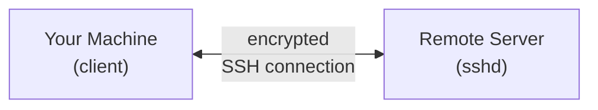
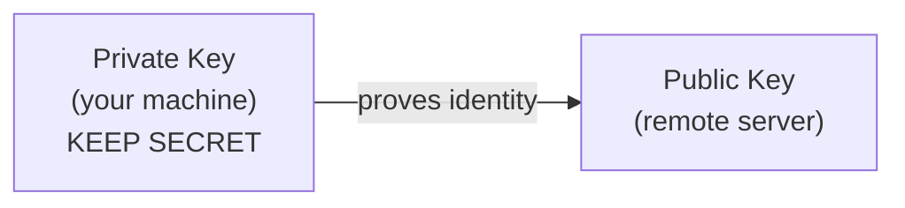

# Lesson 16 — SSH and Remote Access

> **Goal:** Understand secure remote access using SSH — connecting, key authentication, configuration, and file transfers.

---

## What is SSH?

**SSH** (Secure Shell) is the standard way to connect to remote Linux machines. It encrypts all traffic between your computer and the server.



The SSH server (`sshd`) listens on port **22** by default.

---

## Connecting to a Remote Machine

### Basic Connection

```bash
ssh username@hostname
ssh student@192.168.1.100
ssh student@myserver.example.com
```

You will be asked for the remote user's password (first time you will also confirm the server fingerprint).

### Specifying a Port

```bash
# Connect on a non-standard port
ssh -p 2222 student@192.168.1.100
```

### Running a Single Command

You do not need an interactive session to run one command:

```bash
ssh student@remote-host "uptime"
ssh student@remote-host "df -h && free -h"
```

---

## SSH Key Authentication

Passwords are inconvenient and less secure. SSH keys are the preferred method.

### How It Works



- **Private key** stays on your machine (never share it)
- **Public key** goes on every server you want to access

### Generating a Key Pair

```bash
# -t = key type (ed25519 is modern and secure)
# -C = comment (usually your email or username@host, attached to the key)
ssh-keygen -t ed25519 -C "student@ubuntu-lab"
```

You will be prompted for:

- **File location** — press Enter for the default (`~/.ssh/id_ed25519`)
- **Passphrase** — optional but recommended for extra security

This creates two files:

| File | Purpose |
| ---- | ------- |
| `~/.ssh/id_ed25519` | Private key (keep secret, permissions must be 600) |
| `~/.ssh/id_ed25519.pub` | Public key (share with servers) |

### Copying Your Key to a Server

```bash
ssh-copy-id student@remote-host
```

This appends your public key to `~/.ssh/authorized_keys` on the remote machine. After this, you can log in without a password.

### Manual Key Copy

If `ssh-copy-id` is not available:

```bash
# View your public key
cat ~/.ssh/id_ed25519.pub

# On the remote machine, add it manually
mkdir -p ~/.ssh
chmod 700 ~/.ssh
echo "paste-your-public-key-here" >> ~/.ssh/authorized_keys
chmod 600 ~/.ssh/authorized_keys
```

### Key File Permissions

SSH is strict about permissions. If they are too open, SSH refuses to use the key:

```bash
chmod 700 ~/.ssh                 # 700 = owner: read+write+execute, all others: none
chmod 600 ~/.ssh/id_ed25519      # 600 = owner: read+write, all others: none
chmod 644 ~/.ssh/id_ed25519.pub  # 644 = owner: read+write, group/others: read only
chmod 600 ~/.ssh/authorized_keys # 600 = owner: read+write, all others: none
```

---

## SSH Config File

The `~/.ssh/config` file saves connection settings so you do not have to type them every time.

### Creating a Config

```bash
nano ~/.ssh/config
```

```text
Host myserver
    HostName 192.168.1.100
    User student
    Port 22
    IdentityFile ~/.ssh/id_ed25519

Host work
    HostName work.example.com
    User admin
    Port 2222

Host *
    ServerAliveInterval 60
    ServerAliveCountMax 3
```

### Using Config Entries

```bash
# Instead of: ssh -p 2222 admin@work.example.com
ssh work

# Instead of: ssh student@192.168.1.100
ssh myserver
```

### Useful Config Options

| Option | Purpose |
| ------ | ------- |
| `HostName` | IP or domain of the server |
| `User` | Username to log in as |
| `Port` | SSH port number |
| `IdentityFile` | Path to private key |
| `ServerAliveInterval` | Seconds between keepalive pings |
| `ForwardAgent` | Forward your SSH agent to the remote host |
| `ProxyJump` | Jump through a bastion/jump host |

---

## Transferring Files

### `scp` — Secure Copy

```bash
# Copy a local file to a remote machine
scp myfile.txt student@remote-host:/home/student/

# Copy from remote to local
scp student@remote-host:/var/log/syslog ./remote-syslog.log

# Copy a directory recursively (-r = recursive, include subdirectories)
scp -r ~/project student@remote-host:/home/student/

# Use a non-standard port (-P = port number; note: uppercase P, unlike ssh's lowercase -p)
scp -P 2222 myfile.txt student@remote-host:~/
```

### `rsync` — Efficient Sync

`rsync` only transfers files that have changed — much faster for repeated transfers:

```bash
# Sync a directory to a remote machine
rsync -avz ~/project/ student@remote-host:/home/student/project/

# Sync from remote to local
rsync -avz student@remote-host:/var/log/ ./remote-logs/

# Dry run (show what would happen without doing it)
rsync -avzn ~/project/ student@remote-host:/home/student/project/
```

| Flag | Meaning |
| ---- | ------- |
| `-a` | Archive mode (preserves permissions, timestamps, etc.) |
| `-v` | Verbose output |
| `-z` | Compress data during transfer |
| `-n` | Dry run |
| `--delete` | Remove files on destination that are not in source |
| `--exclude` | Skip matching files |

### `sftp` — Interactive File Transfer

```bash
sftp student@remote-host
```

Inside the sftp session:

| Command | Action |
| ------- | ------ |
| `ls` | List remote files |
| `lls` | List local files |
| `cd` | Change remote directory |
| `lcd` | Change local directory |
| `get file` | Download a file |
| `put file` | Upload a file |
| `exit` | Quit |

---

## SSH Tunneling (Port Forwarding)

SSH can forward network traffic through an encrypted tunnel.

### Local Port Forwarding

Access a remote service through a local port:

```bash
# Forward local port 8080 to remote port 80
ssh -L 8080:localhost:80 student@remote-host

# Now http://localhost:8080 on your machine reaches port 80 on the remote host
```

### Remote Port Forwarding

Expose a local service to the remote machine:

```bash
# Make local port 3000 accessible on the remote host's port 9000
ssh -R 9000:localhost:3000 student@remote-host
```

### Dynamic Port Forwarding (SOCKS Proxy)

```bash
# Create a SOCKS proxy on local port 1080
ssh -D 1080 student@remote-host

# Configure your browser to use localhost:1080 as a SOCKS proxy
```

---

## SSH Agent

The SSH agent holds your private keys in memory so you do not have to enter your passphrase repeatedly.

```bash
# Start the agent (-s = output Bourne shell commands to set env variables)
eval "$(ssh-agent -s)"

# Add your key (prompts for passphrase if the key has one)
ssh-add ~/.ssh/id_ed25519

# List loaded keys (-l = list fingerprints of all loaded keys)
ssh-add -l

# Forward agent to remote hosts (-A = enable agent forwarding;
# lets you use your local keys on the remote host)
ssh -A student@remote-host
```

---

## Practicing in the Docker Lab

Since our lab is a single container, we can practice SSH by connecting to localhost:

```bash
# Start the SSH service
sudo service ssh start

# Generate a key pair (-t = key type, -C = comment label)
ssh-keygen -t ed25519 -C "practice-key"

# Copy the key to localhost
ssh-copy-id student@localhost

# Connect via SSH to yourself
ssh student@localhost

# Run a remote command (uname -a = print all system information)
ssh student@localhost "uname -a"

# Copy a file via scp
scp practice/welcome.txt student@localhost:/tmp/
```

---

## Exercises

1. Generate an Ed25519 SSH key pair.
2. Start the SSH service and connect to `localhost` using your key.
3. Create an SSH config entry for `localhost` so you can connect by typing just `ssh lab`.
4. Use `scp` to copy `practice/fruits.txt` to `/tmp/` via SSH.
5. Use `rsync` to sync the `practice/` directory to `/tmp/practice-backup/` via SSH.
   (`rsync -avz`: `-a` = archive mode preserving permissions, `-v` = verbose, `-z` = compress)

---

## Challenge

Set up a complete SSH workflow:

1. Generate a key pair with a passphrase
2. Configure the SSH agent so you only enter the passphrase once
3. Create an SSH config with a named host
4. Write a script that connects via SSH, runs `df -h` and `free -h`, and saves the output locally

<!-- markdownlint-disable MD033 -->
<details>
<summary>💡 Solution</summary>

```bash
# 1. Generate key with passphrase
ssh-keygen -t ed25519 -C "challenge-key" -f ~/.ssh/challenge_key
# Enter a passphrase when prompted

# 2. Start agent and add key
eval "$(ssh-agent -s)"
ssh-add ~/.ssh/challenge_key

# 3. Create config
cat >> ~/.ssh/config << 'CONFIG'

Host lab
    HostName localhost
    User student
    IdentityFile ~/.ssh/challenge_key
CONFIG

chmod 600 ~/.ssh/config
ssh-copy-id -i ~/.ssh/challenge_key student@localhost

# 4. Remote info script
cat > ~/practice/remote-info.sh << 'SCRIPT'
#!/bin/bash

host="${1:-lab}"
output="$HOME/practice/remote-report-$(date +%Y%m%d).txt"

{
    echo "=== Remote System Report ==="
    echo "Host: $host"
    echo "Date: $(date)"
    echo ""
    echo "=== Disk Usage ==="
    ssh "$host" "df -h"
    echo ""
    echo "=== Memory Usage ==="
    ssh "$host" "free -h"
} | tee "$output"

echo ""
echo "Report saved to: $output"
SCRIPT

chmod +x ~/practice/remote-info.sh

# Start SSH and test
sudo service ssh start
~/practice/remote-info.sh lab
```

</details>
<!-- markdownlint-enable MD033 -->

---

**[← Lesson 15](15-shell-customization.md)** | **[Lesson 17 →](17-git-basics.md)**
