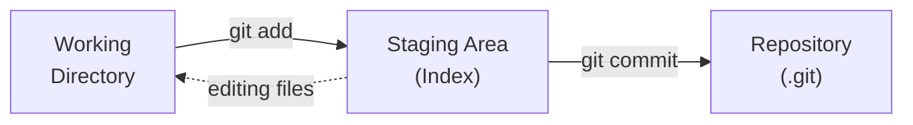

# Lesson 17 — Git Basics

> **Goal:** Learn version control fundamentals — track changes, create branches, and collaborate using Git.

---

## What is Git?

**Git** is a distributed version control system. It tracks every change you make to files so you can:

- See the full history of a project
- Undo mistakes by reverting to any previous state
- Work on features in isolation (branches)
- Collaborate with others without overwriting each other's work

Git is already installed in your Docker lab.

---

## Configuration

Before using Git, set your identity:

```bash
# --global = apply to all repositories for this user (not just the current one)
git config --global user.name "Your Name"
git config --global user.email "you@example.com"

# Set default editor
git config --global core.editor nano

# Set default branch name
git config --global init.defaultBranch main

# View your config (--list = show all settings)
git config --list
```

---

## Creating a Repository

### `git init` — Start Tracking a Project

```bash
mkdir ~/practice/myproject
cd ~/practice/myproject
git init
```

This creates a hidden `.git/` directory that stores all version history.

```bash
ls -la
# You will see .git/
```

---

## The Three Areas

Git has three conceptual areas:



- **Working Directory** — the files you see and edit
- **Staging Area** — files you have marked for the next commit
- **Repository** — the saved history of commits

---

## Basic Workflow

### Step 1 — Create or Edit Files

```bash
echo "# My Project" > README.md
echo "Hello World" > hello.txt
```

### Step 2 — Check Status

```bash
git status
```

This shows which files are new, modified, or staged.

### Step 3 — Stage Files

```bash
# Stage a specific file
git add README.md

# Stage multiple files
git add README.md hello.txt

# Stage everything
git add .
```

### Step 4 — Commit

```bash
git commit -m "Initial commit: add README and hello"
```

A commit is a snapshot of your staged files with a message describing the change.

### Step 5 — View History

```bash
git log

# Compact one-line format (--oneline = show each commit as a single line)
git log --oneline

# With a graph (--graph = draw an ASCII branch graph)
git log --oneline --graph
```

---

## Viewing Changes

### `git diff` — What Changed?

```bash
# Changes in working directory (not yet staged)
git diff

# Changes that are staged (ready to commit)
# --staged = compare staged changes against the last commit
git diff --staged

# Changes between two commits
git diff abc1234 def5678
```

### `git show` — View a Specific Commit

```bash
git show HEAD        # Latest commit
git show abc1234     # A specific commit
```

---

## Undoing Things

### Unstage a File

```bash
# --staged = move file back from staging area to working directory
git restore --staged hello.txt
```

### Discard Changes in Working Directory

```bash
# Revert a file to the last committed version
git restore hello.txt
```

### Amend the Last Commit

```bash
# Fix the commit message (-m = message; --amend = replace the last commit)
git commit --amend -m "Better commit message"

# Add a forgotten file to the last commit (--no-edit = keep the existing message)
git add forgotten-file.txt
git commit --amend --no-edit
```

### Revert a Commit (Safe)

Create a new commit that undoes a previous one:

```bash
git revert HEAD           # Undo the latest commit
git revert abc1234        # Undo a specific commit
```

---

## Branches

Branches let you work on features without affecting the main code.

### Creating and Switching Branches

```bash
# Create a new branch
git branch feature-login

# Switch to it
git checkout feature-login

# Or create and switch in one step (-b = create branch if it doesn't exist)
git checkout -b feature-login
```

### Viewing Branches

```bash
# List all branches (* marks the current one)
git branch

# List with last commit info (-v = verbose, show commit hash and message)
git branch -v
```

### Merging Branches

When your feature is done, merge it into `main`:

```bash
# Switch to main
git checkout main

# Merge the feature branch
git merge feature-login
```

### Deleting a Branch

```bash
# After merging, clean up (-d = delete; only works if the branch was already merged)
git branch -d feature-login
```

### Merge Conflicts

When two branches change the same line, Git cannot merge automatically:

```text
<<<<<<< HEAD
This is the main version
=======
This is the feature version
>>>>>>> feature-branch
```

To resolve:

1. Open the file and choose which version to keep (or combine them)
2. Remove the conflict markers (`<<<<<<<`, `=======`, `>>>>>>>`)
3. Stage and commit

```bash
nano conflicted-file.txt    # Fix the conflict
git add conflicted-file.txt
git commit -m "Resolve merge conflict"
```

---

## `.gitignore` — Excluding Files

Create a `.gitignore` file to tell Git which files to skip:

```bash
cat > .gitignore << 'EOF'
# Compiled files
*.o
*.pyc
__pycache__/

# Editor files
*.swp
*~
.vscode/

# OS files
.DS_Store
Thumbs.db

# Secrets
.env
*.key
EOF

git add .gitignore
git commit -m "Add gitignore"
```

---

## Working with Remotes

Remotes are copies of your repository on another machine (like GitHub).

### Adding a Remote

```bash
git remote add origin https://github.com/username/repo.git

# View remotes (-v = verbose, show the fetch and push URLs)
git remote -v
```

### Push — Upload Your Commits

```bash
# Push main branch to the remote
# -u = set upstream tracking (links local branch to remote branch)
git push -u origin main

# After the first push, just:
git push
```

### Pull — Download Changes

```bash
git pull origin main

# Or just (if tracking is set up):
git pull
```

### Clone — Copy an Existing Repository

```bash
git clone https://github.com/username/repo.git
cd repo
```

---

## Useful Git Commands Cheat Sheet

| Command | Purpose |
| ------- | ------- |
| `git init` | Create a new repository |
| `git status` | See what has changed |
| `git add .` | Stage all changes |
| `git commit -m "msg"` | Save a snapshot |
| `git log --oneline` | View commit history |
| `git diff` | See unstaged changes |
| `git branch` | List branches |
| `git checkout -b name` | Create and switch to a branch |
| `git merge branch` | Merge a branch into current |
| `git remote -v` | List remote repositories |
| `git push` | Upload commits to remote |
| `git pull` | Download commits from remote |
| `git clone url` | Copy a remote repository |
| `git stash` | Temporarily save uncommitted changes |
| `git stash pop` | Restore stashed changes |

---

## Exercises

1. Create a new Git repository in `~/practice/git-lab`.
2. Create a `README.md`, stage it, and make your first commit.
3. Edit `README.md`, use `git diff` to see the changes, then commit.
4. Create a branch called `feature`, add a new file on it, then merge it back to `main`.
5. Create a `.gitignore` that ignores `*.tmp` and `*.log` files.
6. Use `git log --oneline --graph` (`--oneline` = one line per commit, `--graph` = ASCII branch diagram) to see the branch and merge history.

---

## Challenge

Simulate a full Git workflow:

1. Create a repository with a `README.md` and an `app.sh` script
2. Make 3 commits on `main` (initial commit, add script, update README)
3. Create a `feature` branch, make 2 commits on it
4. Switch back to `main`, make 1 more commit (this creates divergent history)
5. Merge the feature branch (resolve any conflict if needed)
6. View the full history with `git log --oneline --graph --all` (`--all` = include all branches, not just the current one)

<!-- markdownlint-disable MD033 -->
<details>
<summary>💡 Solution</summary>

```bash
# Setup
mkdir ~/practice/git-lab && cd ~/practice/git-lab
git init
git config user.name "Student"
git config user.email "student@ubuntu-lab"

# Commit 1 — Initial
echo "# My App" > README.md
git add . && git commit -m "Initial commit"

# Commit 2 — Add script
cat > app.sh << 'EOF'
#!/bin/bash
echo "App version 1.0"
EOF
chmod +x app.sh
git add . && git commit -m "Add app script"

# Commit 3 — Update README
echo "A sample application." >> README.md
git add . && git commit -m "Update README with description"

# Feature branch — Commit 4 & 5
git checkout -b feature
echo 'echo "Feature: login system"' >> app.sh
git add . && git commit -m "Add login feature"
echo "## Features" >> README.md
echo "- Login system" >> README.md
git add . && git commit -m "Document login feature"

# Back to main — Commit 6
git checkout main
echo "## Installation" >> README.md
echo "Run ./app.sh" >> README.md
git add . && git commit -m "Add installation instructions"

# Merge
git merge feature -m "Merge feature branch"
# If there is a conflict in README.md, edit it, then:
#   git add README.md
#   git commit -m "Resolve merge conflict"

# View history
git log --oneline --graph --all
```

</details>
<!-- markdownlint-enable MD033 -->

---

**[← Lesson 16](16-ssh-remote-access.md)** | **[Lesson 18 →](18-docker-basics.md)**
