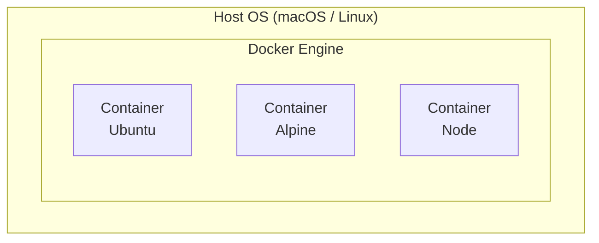

# Lesson 18 — Docker Basics

> **Goal:** Understand containerization fundamentals — what Docker does, how images and containers work, and basic Docker commands.

---

## What is Docker?

**Docker** packages applications into **containers** — lightweight, isolated environments that include everything an application needs to run: code, libraries, and system tools.

You have been using Docker this entire course. Your Linux lab is a Docker container running Ubuntu 24.04.

### Containers vs Virtual Machines

| Feature | Container | Virtual Machine |
| ------- | --------- | --------------- |
| Startup time | Seconds | Minutes |
| Size | MBs | GBs |
| OS | Shares host kernel | Full OS per VM |
| Isolation | Process-level | Hardware-level |
| Performance | Near-native | Overhead from hypervisor |



---

## Key Concepts

| Term | Meaning |
| ---- | ------- |
| **Image** | A read-only template (like a snapshot or recipe) |
| **Container** | A running instance of an image |
| **Dockerfile** | A text file with instructions to build an image |
| **Volume** | Persistent storage that survives container restarts |
| **Registry** | A place to store and share images (e.g., Docker Hub) |

Think of it this way: an **image** is a class, a **container** is an instance of that class.

---

## Your First Docker Commands

> **Note:** These commands are meant to be run on your **host machine** (not inside the Linux lab container). Open a new terminal on your host to follow along.

### Checking Docker

```bash
docker --version
docker compose version
```

### Running a Container

```bash
# Run a simple container that prints a message and exits
docker run hello-world

# Run Ubuntu interactively
docker run -it ubuntu:24.04 bash
# Type 'exit' to leave
```

### What Just Happened?

1. Docker checked if the `hello-world` image exists locally
2. If not, it pulled (downloaded) it from Docker Hub
3. Created a container from the image
4. Ran the container
5. The container exited after printing its message

---

## Managing Images

### Listing Images

```bash
docker images
# or
docker image ls
```

### Pulling Images

```bash
# Download an image without running it
docker pull ubuntu:24.04
docker pull alpine:latest
docker pull nginx
```

### Removing Images

```bash
docker rmi hello-world
# or
docker image rm hello-world
```

---

## Managing Containers

### Listing Containers

```bash
# Running containers
docker ps

# All containers (including stopped ones)
# -a = all, show every container regardless of state
docker ps -a
```

### Running Containers

```bash
# Run in the background (detached)
docker run -d --name my-nginx nginx

# Run interactively
docker run -it --name my-ubuntu ubuntu:24.04 bash

# Run with a port mapping (host:container)
docker run -d -p 8080:80 --name web nginx
# Now http://localhost:8080 serves the nginx welcome page

# Run with environment variables
docker run -d --name my-app -e MY_VAR=hello nginx
```

| Flag | Meaning |
| ---- | ------- |
| `-d` | Detached (background) |
| `-it` | Interactive with terminal |
| `--name` | Give the container a name |
| `-p` | Map ports (host:container) |
| `-e` | Set environment variable |
| `-v` | Mount a volume |
| `--rm` | Remove container when it exits |

### Stopping and Starting

```bash
docker stop my-nginx
docker start my-nginx
docker restart my-nginx
```

### Executing Commands Inside a Running Container

This is how you have been entering your Linux lab:

```bash
docker exec -it my-nginx bash
```

### Viewing Logs

```bash
docker logs my-nginx

# Follow logs in real time (-f = follow, stream new output as it appears)
docker logs -f my-nginx
```

### Removing Containers

```bash
# Remove a stopped container
docker rm my-nginx

# Force remove a running container (-f = force, stop and remove even if running)
docker rm -f my-nginx

# Remove all stopped containers (prune = clean up unused resources)
docker container prune
```

---

## Dockerfile — Building Your Own Image

A **Dockerfile** is a recipe for building an image.

### Anatomy of a Dockerfile

Look at the Dockerfile that builds your Linux lab:

```bash
# From the host machine, in the course directory
cat Dockerfile
```

Key instructions:

| Instruction | Purpose | Example |
| ----------- | ------- | ------- |
| `FROM` | Base image to start from | `FROM ubuntu:24.04` |
| `RUN` | Run a command during build | `RUN apt-get update` |
| `COPY` | Copy files from host to image | `COPY app.py /app/` |
| `WORKDIR` | Set the working directory | `WORKDIR /app` |
| `ENV` | Set an environment variable | `ENV PORT=8080` |
| `EXPOSE` | Document which port the app uses | `EXPOSE 8080` |
| `CMD` | Default command when container starts | `CMD ["python", "app.py"]` |
| `USER` | Switch to a non-root user | `USER student` |

### Building an Image

```bash
# Build from a Dockerfile in the current directory
# -t = tag (name) the image; . = build context (current directory)
docker build -t my-image .

# Build with a specific Dockerfile
# -f = specify Dockerfile path; -t = tag with a name:version
docker build -f Dockerfile.dev -t my-image:dev .
```

### Example — Build a Simple Image

Create a small project to try it:

```bash
mkdir ~/shared/docker-test
cd ~/shared/docker-test

# Create a simple script
cat > hello.sh << 'EOF'
#!/bin/bash
echo "Hello from inside a container!"
echo "Running as: $(whoami)"
echo "Date: $(date)"
echo "Hostname: $(hostname)"
EOF
chmod +x hello.sh

# Create a Dockerfile
cat > Dockerfile << 'EOF'
FROM ubuntu:24.04
COPY hello.sh /usr/local/bin/hello.sh
CMD ["/usr/local/bin/hello.sh"]
EOF
```

Then on your **host machine**:

```bash
cd shared/docker-test
docker build -t my-hello .
docker run --rm my-hello
```

---

## Volumes — Persistent Data

Containers are ephemeral — when you delete one, its data is gone. Volumes let data persist.

### Bind Mounts

Map a host directory into the container:

```bash
# The shared/ folder in this course is a bind mount
# -v = volume mount (host_path:container_path)
docker run -it -v /path/on/host:/path/in/container ubuntu:24.04 bash
```

### Named Volumes

Docker manages the storage:

```bash
# Create a named volume
docker volume create mydata

# Use it in a container
docker run -it -v mydata:/data ubuntu:24.04 bash
# Any files saved in /data persist even if the container is deleted

# List volumes
docker volume ls

# Remove a volume
docker volume rm mydata
```

---

## Docker Compose

Docker Compose manages multi-container setups using a YAML file. You have been using it to run your lab.

### The `docker-compose.yml` File

```bash
# View the one for this course
cat docker-compose.yml
```

### Common Commands

| Command | Purpose |
| ------- | ------- |
| `docker compose up -d` | Start containers in background |
| `docker compose down` | Stop and remove containers |
| `docker compose ps` | List running services |
| `docker compose logs` | View logs |
| `docker compose build` | Rebuild images |
| `docker compose exec service bash` | Shell into a service |
| `docker compose stop` | Stop without removing |
| `docker compose start` | Start stopped containers |

---

## Understanding the Linux Lab Setup

Now you can understand every part of your learning environment:

```bash
# The Dockerfile creates an Ubuntu image with learning tools
cat Dockerfile

# docker-compose.yml defines how to run it
cat docker-compose.yml

# reset-lab.sh destroys and recreates the container
cat reset-lab.sh
```

The `shared/` folder is a **bind mount** — changes appear on both host and container instantly. That is why files you save there persist across container rebuilds.

---

## Docker Cleanup

Over time, Docker accumulates unused data:

```bash
# Remove all stopped containers
docker container prune

# Remove unused images (images not referenced by any container)
docker image prune

# Remove unused volumes (careful — deletes data)
docker volume prune

# Remove everything unused (containers, images, networks, cache)
docker system prune

# See how much space Docker is using (df = disk free, similar to Linux df)
docker system df
```

---

## Exercises

> Run these on your **host machine**, not inside the Linux lab.

1. Pull the `alpine` image and run it interactively. Explore what commands are available (Alpine uses `apk` instead of `apt`).
2. Run an `nginx` container in the background with port 8080 mapped to port 80. Verify it works with `curl http://localhost:8080`.
3. Build the `my-hello` image from the example above and run it.
4. Create a named volume, mount it into an Ubuntu container, write a file, exit, then start a new container with the same volume and verify the file is still there.
5. Examine the Dockerfile and docker-compose.yml for this course and identify every instruction used.

---

## Challenge

Create a Dockerfile for a simple "quote of the day" container that:

1. Uses `ubuntu:24.04` as the base
2. Creates a text file with at least 5 quotes (one per line)
3. On startup, picks a random quote and displays it with `cowsay` (install cowsay in the Dockerfile)
4. Build it and run it — each run should show a different quote

<!-- markdownlint-disable MD033 -->
<details>
<summary>💡 Solution</summary>

Create these files in `~/shared/quote-container/`:

```bash
mkdir -p ~/shared/quote-container
cd ~/shared/quote-container

cat > quotes.txt << 'EOF'
The only way to learn Linux is to use Linux.
Talk is cheap. Show me the code. - Linus Torvalds
In a world without walls and fences, who needs Windows and Gates?
There is no place like 127.0.0.1.
sudo make me a sandwich.
EOF

cat > Dockerfile << 'DOCKER'
FROM ubuntu:24.04
ENV DEBIAN_FRONTEND=noninteractive
ENV PATH="/usr/games:$PATH"
RUN apt-get update && apt-get install -y cowsay && rm -rf /var/lib/apt/lists/*
COPY quotes.txt /quotes.txt
CMD shuf -n 1 /quotes.txt | cowsay
DOCKER
```

Then on your **host machine**:

```bash
cd shared/quote-container
docker build -t quote-of-the-day .
docker run --rm quote-of-the-day
docker run --rm quote-of-the-day
docker run --rm quote-of-the-day
```

</details>
<!-- markdownlint-enable MD033 -->

---

## What's Next?

Congratulations! You have completed the Linux tutorial. Here are topics to explore further:

- **Tmux** — Terminal multiplexer for productivity
- **Ansible** — Automate server configuration
- **Kubernetes** — Container orchestration at scale
- **CI/CD** — Automated testing and deployment pipelines
- **Linux Certifications** — LPIC-1, CompTIA Linux+
- **Systemd** — Service management in depth
- **Firewall** — `ufw` / `iptables`

---

**[← Lesson 17](17-git-basics.md)** | **[Lesson 19 →](19-login-auditing.md)** | **[Back to Home →](../index.md)**
